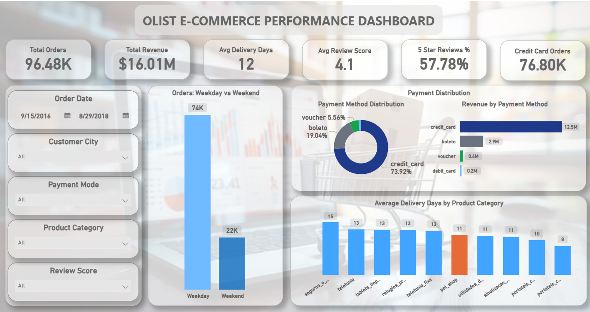
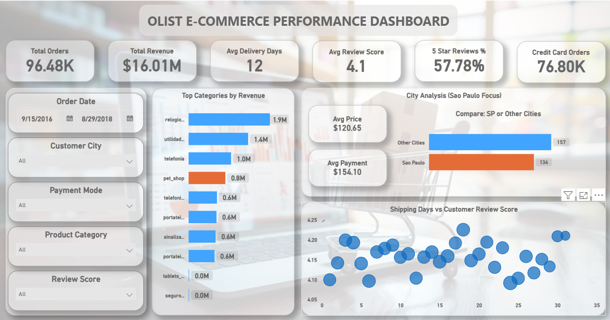
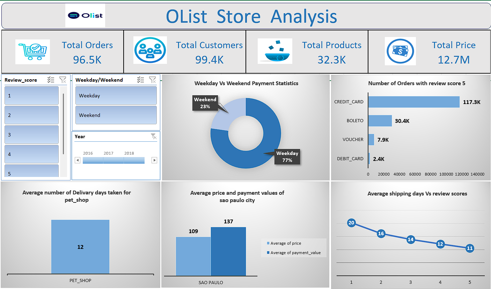
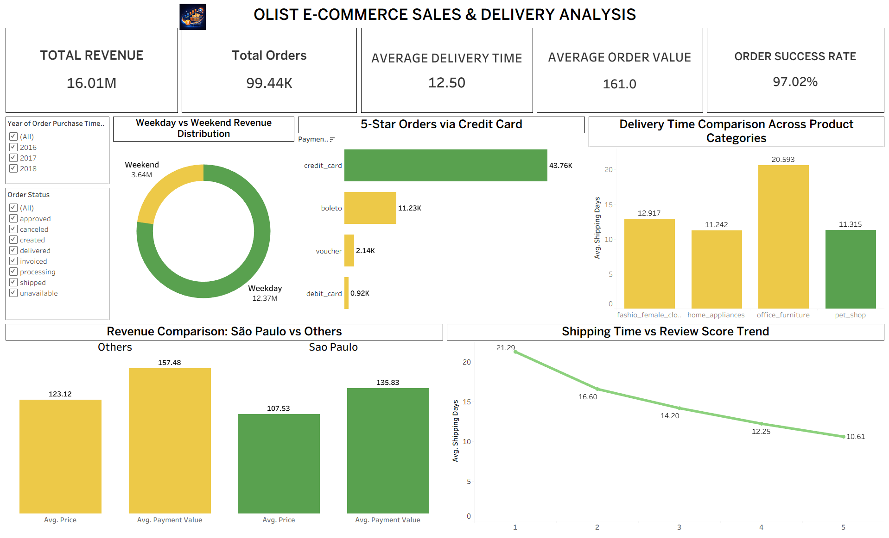
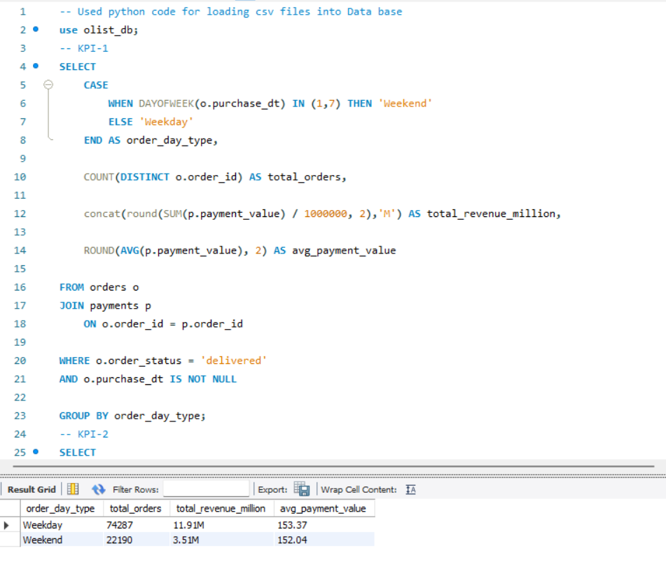
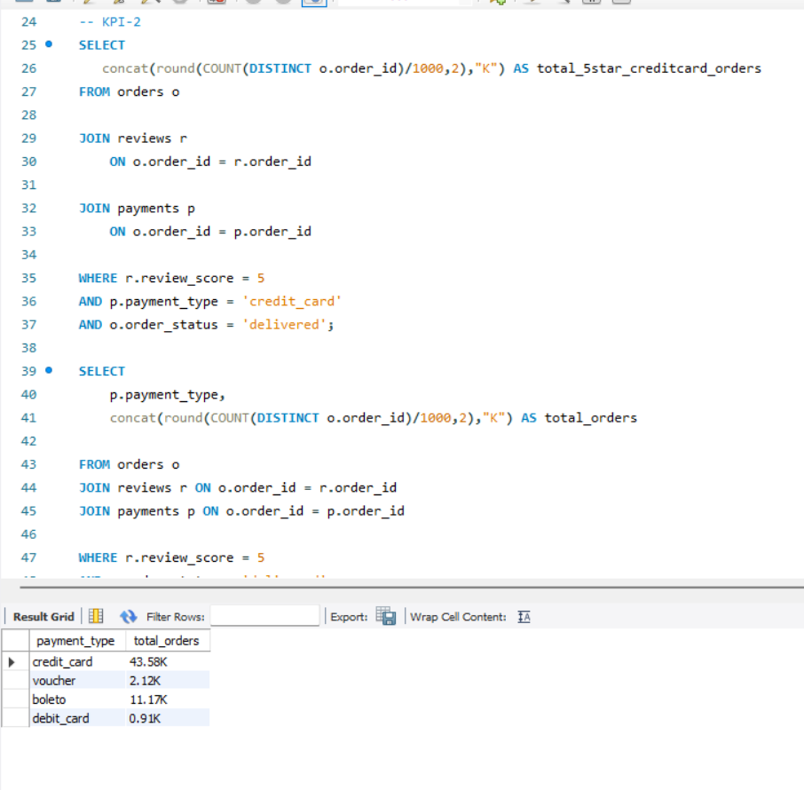
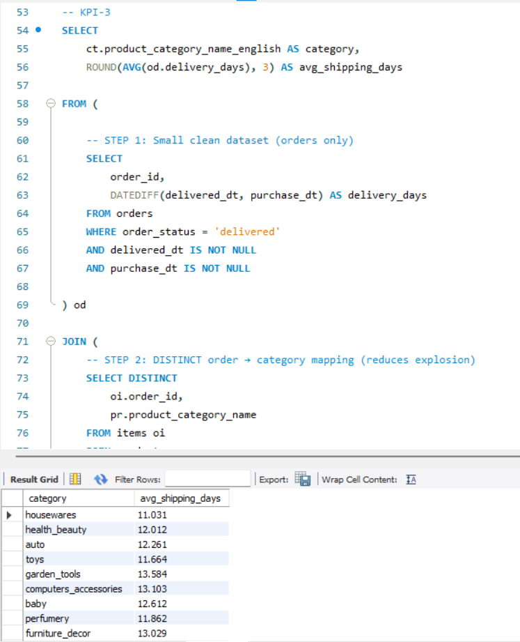
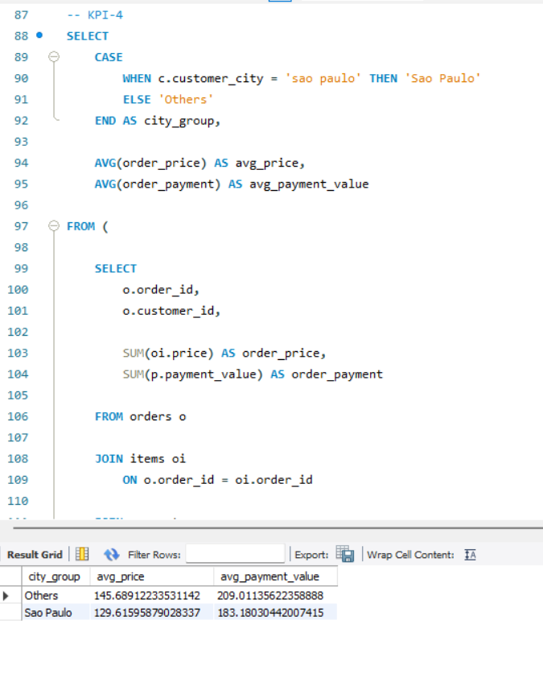

# Olist E-Commerce Store Analysis

## Project Overview

This project analyzes the Olist E-Commerce dataset using Excel, SQL, Power BI, and Tableau to identify customer behavior, payment trends, delivery performance, product category insights, and revenue patterns.

The project demonstrates data cleaning, SQL analysis, dashboard development, and business intelligence reporting.

---

## Tools Used

- Excel
- MySQL
- Power BI
- Tableau

---

## Project Structure

Olist-Ecommerce-Store-Analysis

├── Excel-Dashboard

├── SQL-Analysis

├── PowerBI-Dashboard

├── Tableau-Dashboard

├── Images

└── README.md

---

## Business Problems Solved

- Weekday vs Weekend order analysis
- Payment method distribution
- Delivery performance tracking
- Customer review score analysis
- Product category performance
- Revenue comparison by cities
- Shipping days vs customer satisfaction

---

## Dashboard Preview

### Power BI Dashboards

---

### Excel Dashboards

---

### Tableau Dashboard

---

### SQL Analysis Results

---

## Key Insights

- Most orders were placed on weekdays
- Credit card was the most preferred payment method
- Faster deliveries resulted in better review scores
- Sao Paulo generated high revenue contribution
- Certain product categories required longer delivery times

---

## Author

Harsha Vardhan Raju Karapa

Aspiring Data Analyst
